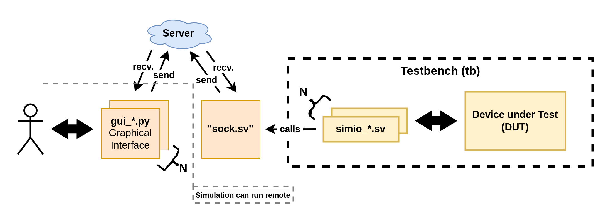
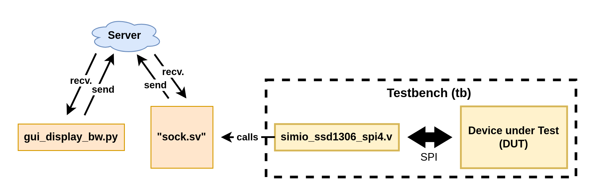
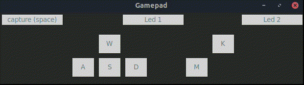
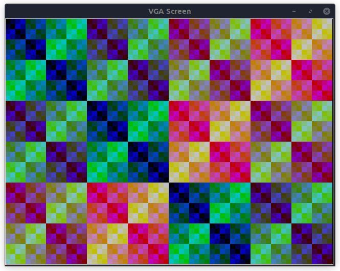
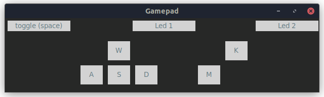
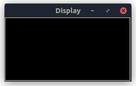
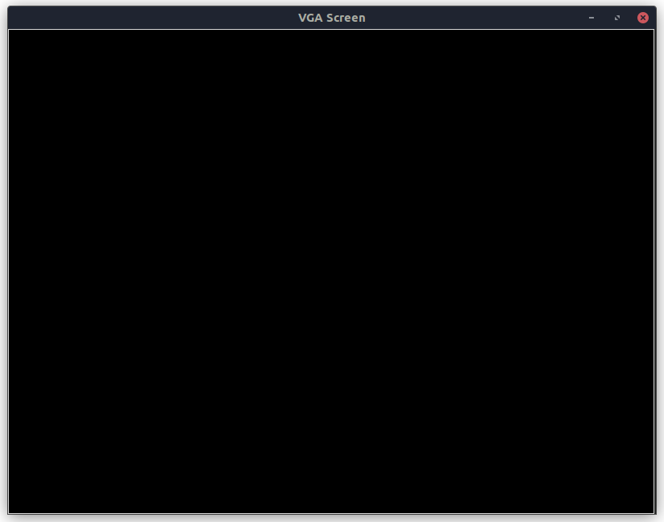

# SimIO

SimIO is a library of modular virtual peripherals to interact with a running HDL simulation. It consists of a collection of lightweight components that can be attached to the device under test (DUT) by instantiating the desired SimIO component in a SystemVerilog wrapper/testbench. For example, a virtual VGA screen display can be instantiated in the testbench. Wiring is as easy as connecting `Red`, `Green`, `Blue`, as well as the synchronization signals `VSync` and `HSync` from your design and the SimIO component. The Python GUI (irtual VGA screen) receives live data from the simulation and displays the image. The library builds on the SystemVerilog Direct Programming Interface (DPI) and is simulator-agnostic.

> [!IMPORTANT]  
> :triangular_ruler: Please note that the library is work in progress. Please feel free to open a PR for bugfixes or adding components.


# Operation



The diagram above depicts the structure of the library. The testbench includes a SystemVerilog instance of each used SimIO component (`simio_*.sv`) and connects the needed signals. All communication to the server is handled inside the SimIO component. Input data is converted into a JSON string that is sent to the server and can be received by the Python GUI. Outputs of the SimIO component (that are connected to inputs of your DUT) are communicated from the GUI to the SimIO component analogously.

# SSD1306




The example shows the data flow for an SSD1306 OLED display with SPI interface. `simio_ssd1306_spi4.sv` implements the SystemVerilog model that can be instantiated in the simulation. It receives the data and maintains an internal state, e.g., the addressing mode it is configured to. The hardware-specific configuration is converted into a display-generic interpretation, e.g., (a) display inverted: true/false, (b) display pixel data, etc. This information is parsed to a JSON string by `json.sv`. Once parsed, the DPI-C is used to communicate with a Python socket server by `sock.sv`. It receives the JSON string and distributes it to all clients connected to the server. In this example, it is `gui_display_bw.py`, a generic black-and-white display. An identifier prefixes each JSON stringr, so only the addressed client will process it. The client decodes the data and, in the case of the display GUI, draws the data on a tkinter canvas.

# Quickstart
This Quickstart demonstrates how to get started by example.

## Prepare venv

Prepare the virtual environment and activate it in all shell sessions.

```shell
git submodule update --init
python3 -m venv .venv
source .venv/bin/activate
pip3 install -r requirements.txt
```

## Server

The server must be running to exchange data between the graphical user interfaces and the simulation. Start it with

```python
python3 server/server.py
```

## Gamepad

<p align="center">
  
</p>

<table>
<tr>
<th>DUT</th>
<th>SimIO Component</th>
</tr>
<tr>
<td>

```Verilog
blink2en dut (
  .clk_i    ( clk_i   ),
  .rst_in   ( rst_in  ),

  .en1_i    ( en1     ),
  .en2_i    ( en2     ),
  .out1_o   ( out1    ),
  .out2_o   ( out2    )
);
```
</td>
<td>

```Verilog
gamepad i_gamepad (
  .clk_i        ( clk_i ),
  .led1_i       ( out1  ),
  .led2_i       ( out2  ),
  .key_up_o     ( /* not needed here */ ),
  .key_down_o   ( /* not needed here */ ),
  .key_right_o  ( /* not needed here */ ),
  .key_left_o   ( /* not needed here */ ),
  .key_a_o      ( en1   ),
  .key_b_o      ( en2   )
);
```  
</td>
</tr>
</table>


Run GUI (make sure that the server is already running)
```shell
python components/gui/gamepad/gui_gamepad.py -s
```

Run simulation
```shell
make example.gamepad
./examples/gamepad/obj_dir/Vgamepad_wrapper
```

## VGA

The VGA example shows how a virtual display can be used for different VGA resolutions (and timings), as shown by some TinyTapeout projects.


### Shader

Design: [Tiny Shader](https://github.com/mole99/tt06-tiny-shader) by Leo Moser

<p align="center">
  
</p>


Run GUI (make sure that the server is already running)
```shell
python components/gui/display/gui_display_vga.py -s --width 640 --height 480 --low-active \
  --h-front-porch 16 --h-sync-pulse 96 --h-back-porch 48 \
  --v-front-porch 10 --v-sync-pulse 2 --v-back-porch 33 
```

Run simulation
```shell
make example.vga.shader
./examples/vga/shader/obj_dir/Vsim_vga_wrapper
```

### Sprite

Design: [One Sprite Pony](https://github.com/mole99/tt05-one-sprite-pony) by Leo Moser

Run GUI (make sure that the server is already running)
```shell
python components/gui/display/gui_display_vga.py -s --width 800 --height 600 \
  --h-front-porch 40 --h-sync-pulse 128 --h-back-porch 88 \
  --v-front-porch 1 --v-sync-pulse 4 --v-back-porch 23 
```

Run simulation
```shell
make example.vga.sprite
./examples/vga/sprite/obj_dir/Vsim_vga_wrapper
```


### Donut

Design: [Tiny Tapeout Verilog Project - VGA donut](https://github.com/a1k0n/tt08-vga-donut) by Andy Sloane


Run GUI (make sure that the server is already running)
```shell
python components/gui/display/gui_display_vga.py -s --width 640 --height 480 --low-active \
  --h-front-porch 16 --h-sync-pulse 96 --h-back-porch 48 \
  --v-front-porch 10 --v-sync-pulse 2 --v-back-porch 33 
```

Run simulation
```shell
make example.vga.donut
cp -r examples/vga/donut/tt08-vga-donut/data examples/vga/donut/data
cd examples/vga/donut/obj_dir
./Vsim_vga_wrapper
```

## SSD1306

Run GUI (make sure that the server is already running)
```shell
python components/gui/display/gui_display_bw.py -s

```

Run simulation
```shell
make example.ssd1306
./examples/ssd1306/obj_dir/Vsimio_ssd1306_spi4
```


# List of Current Components

| Name                    |                Appearance                 | Features                                                            |
| ----------------------- | :---------------------------------------: | ------------------------------------------------------------------- |
| **Gamepad**             |          | 6 buttons, 2 status leds; _toggle_ or _invert_ buttons on key press |
| **Display Black/White** |    | Generic Black-and-White display                                     |
| **Display VGA**         |  | VGA Color display                                                   |

